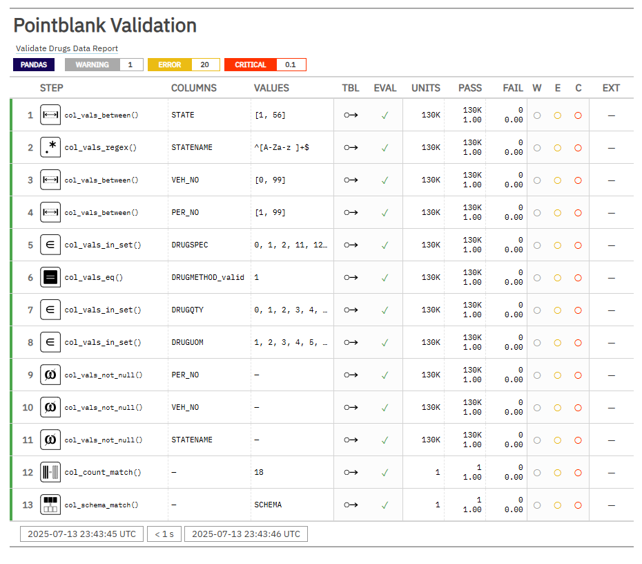

# Exploring Pointblank Python Package

## Overview
This project demonstrates the use of Pointblank for Python - a powerful library for data validation, testing and documenting data quality.
As a learning exercise, I applied data validation checks to a sample dataset from the FARS (Fatality Analysis Reporting System), focusing specifically on the Drugs data.
The goal is to understand how to implement column-level validation rules, build a validation report, and ensure the integrity of real-world data using Python.

## Data
Data used in this project comes from the NHTSA FARS data and can be accessed [here](https://www.nhtsa.gov/file-downloads?p=nhtsa/downloads/FARS/2023/National/).

## Validation Report
The validation report generated from the pointblank package can be accessed via [this URL](https://anchalab.github.io/explore-pointblank/validation_result/drugs_data_validation_report).



## How To Guide

```bash
# Clone the repository
git clone https://github.com/anchalab/explore-pointblank.git

# Move into the project directory
cd explore-pointblank

# Install required packages
pip install -r requirements.txt

# Start Jupyter Notebook
jupyter notebook

# How to use
Navigate to the code/ directory in the Jupyter interface.
Open and run the drugs_data_validation.ipynb file to explore the Pointblank validations.
